### 🗒️ Project one-pager – **Multimodal Transfer-Learning prototype**

| Item                           | Description                                                                                                                                                                                                                                                                                                                                                                                                |                                                                                                                                                       |
| ------------------------------ | ---------------------------------------------------------------------------------------------------------------------------------------------------------------------------------------------------------------------------------------------------------------------------------------------------------------------------------------------------------------------------------------------------------- | ----------------------------------------------------------------------------------------------------------------------------------------------------- |
| **Goal**                       | Turn the **Qwen 3-0.6 B-Base** language model into a light vision–language system that can caption or answer questions about images, using only the **Flickr30k** captions (\~30 k pairs) for fine-tuning.                                                                                                                                                                                                 |                                                                                                                                                       |
| **High-level idea**            | 1) Keep a strong **vision encoder** *frozen* (choose **ViT-B/16** or **CLIP ViT-B/32**). 2) Map its single 768-d / 512-d embedding into Qwen’s 4 096-d token space with a tiny 2-layer **MLP adapter** (trainable). 3) Optionally unfreeze the **top *K*** decoder blocks of Qwen (default *K = 3*) to let the LM specialise. 4) Optimise only adapter + those K blocks on caption cross-entropy. |                                                                                                                                                       |
| **Repository layout**          | *Single* Python file `multimodal_transfer_learning.py` (canvas). Contains: env-driven config, colourful logger, data split (80/10/10), W\&B tracking, training/val/test loops, checkpoint saver (\`../.data/models/{epoch}\_{vit                                                                                                                                                                           | clip}\_topK.pt\`).                                                                                                                                    |
| **Config via `.env`**          | \`VISION\_ENCODER (vit                                                                                                                                                                                                                                                                                                                                                                                     | clip)`, `TOP\_K`, `BATCH\_SIZE`, `EPOCHS`, `LR\_ADAPTER`, `LR\_QWEN`, `SEED`, `OUTPUT\_DIR\_MODELS`, `WANDB\_ENTITY`, `WANDB\_PROJECT`, `HF\_TOKEN\`. |
| **Metrics logged (per epoch)** | BLEU-4, CIDEr-D, Recall\@1/5, Precision\@1/5 – reported to **Weights & Biases** project `mlx8-w4-multimodal-transferlearning`.                                                                                                                                                                                                                                                                             |                                                                                                                                                       |
| **Hardware targets**           | Fits a single 24 GB GPU with BF16 weights, batch = 2, and up to `TOP_K = 3` unfrozen Qwen blocks.                                                                                                                                                                                                                                                                                                          |                                                                                                                                                       |
| **Extra utilities**            | *Tiny* standalone `tiny_decoder.py` shows how to build a 100-line GPT-style decoder if you want to load pretrained weights manually later.                                                                                                                                                                                                                                                                 |                                                                                                                                                       |
| **CLI**                        | `python multimodal_transfer_learning.py --train` → train + eval + save checkpoints. `python multimodal_transfer_learning.py --test` → load last checkpoint, run final test split.                                                                                                                                                                                                                       |                                                                                                                                                       |

#### 🧠 Model Architecture

GPT-4.1

Another version (GPT-o3)

```mermaid
flowchart LR
    %% =========  INPUT  ========= %%
    IMG[User-supplied Image] --> |224×224 RGB| PREP[Pre-processing<br/>Resize · Center-crop · Norm]

    %% =========  VISION ENCODER  ========= %%
    PREP --> VE
    subgraph FrozenVisionEncoder [Frozen Vision Encoder]
        direction TB
        VE[Google ViT-B/16<br/>CLS 768-d]:::vit
        altVE[OpenAI CLIP ViT-B/32<br/>image_emb 512-d]:::clip
    end
    classDef box stroke:#555,stroke-width:1px,fill:#fdfdfd

    %% =========  ADAPTER  ========= %%
    VE -.-> BRIDGE
    altVE -.-> BRIDGE
    BRIDGE[MLP Adapter<br/>in 512/768 → out N×1024<br/>trainable]:::train
    classDef train fill:#e8fff0,stroke:#22aa55,stroke-width:2px

    %% =========  QWEN DECODER  ========= %%
    BRIDGE -->|concat with prompt| QWEN
    subgraph QwenDecoder [Qwen-3-0.6B Decoder]
        direction TB
        QWEN[28-layer GPT-style<br/>decoder d = 1024]:::frozen
        TOPK[Top-K layers<br/>unfrozen K = 0–3]:::train
    end
    classDef frozen fill:#f0f4ff,stroke:#4466dd

    QWEN --> TEXT[Text output<br/>caption / VQA answer]

    %% =========  LEGEND  ========= %%
    subgraph Legend
        L1[🔵 Frozen weights]:::frozen
        L2[🟢 Trainable weights]:::train
    end
    
    classDef vit fill:#ffe6e6,stroke:#cc0000,stroke-width:2px
    classDef clip fill:#e6f3ff,stroke:#0066cc,stroke-width:2px
```

Friday version (GPT-4.1)

Legend:

 -   ViT/CLIP Encoder: Frozen vision encoder (ViT or CLIP) produces a single image embedding.
 -   ImageAdapter MLP: Projects the image embedding to 16 vision tokens (each matching Qwen's hidden size).
 -   Tokenizer: Converts prompt/caption to text tokens.
 -   Concat: Vision tokens are prepended to text tokens.
 -   Qwen-3-0.6B: Multimodal language model processes the combined sequence.
 -   Output: Generated caption (during inference) or predicted caption (during training).

Friday (Claude Sonnet 4)

Key Architecture Details:

- Frozen Vision Encoder: Either ViT-B/16 (768-d CLS token) or CLIP ViT-B/32 (512-d image embedding)

- Trainable ImageAdapter: 2-layer MLP that maps single image embedding → 16 vision tokens of 1024-d (Qwen's hidden size)

- Sequence Construction: [v1, v2, ..., v16, t1, t2, ..., tn] where vision tokens are prepended

- Qwen Decoder: 28 layers total, only top-K layers (25-27) are trainable, rest frozen

- Loss: CrossEntropy only on text tokens (vision tokens get label=-100)

- Attention: Vision tokens can attend to all previous tokens, text tokens follow causal masking

**Diagram key**

* 🔵 **Frozen modules** – Vision encoder (ViT-B/16 *or* CLIP ViT-B/32) and most of Qwen’s 28 decoder blocks.
* 🟢 **Trainable modules** – a two-layer MLP **Adapter** that maps the 768-d (ViT) or 512-d (CLIP) image vector into *N* pseudo-tokens of width 1024; plus the **top-K** Qwen blocks you choose to unfreeze (default K = 3, K = 0 means fully frozen).

**End-to-end flow**

1. **Image → Vision Encoder** (frozen) → single global embedding.
2. **Embedding → Adapter** → *N* visual tokens aligned to Qwen’s hidden size.
3. **Visual tokens + text prompt → Qwen Decoder**; only the top-K layers receive gradients during fine-tuning.
4. Decoder autoregressively produces the caption or answer.
